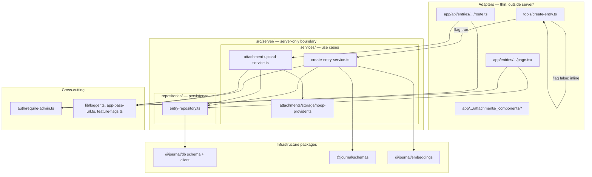
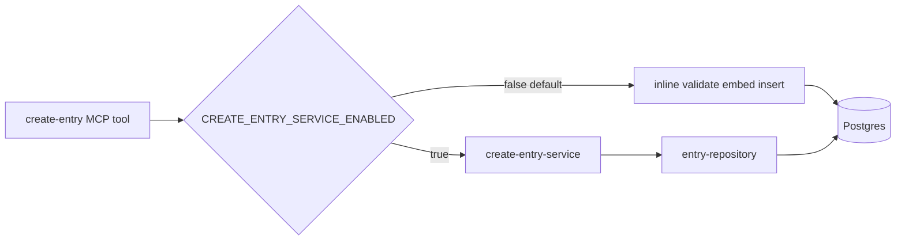

# Entry attachments upload MVP

## What you asked for

After `create_entry` saves via MCP, the tool response includes a full URL you can open manually. That page is admin-only (Clerk), accepts multiple images, tracks per-file status in place (idle → uploading → success/failure with per-file detail), and posts to a noop API that logs filenames verbosely via Pino → Vercel Runtime Logs. No blob storage or `attachments` table yet — designed so step 2 (round-robin CDN backends + DB rows) plugs in without rewriting the UI.

**Route:** [`/entries/[id]/attachments`](apps/web/app/entries/[id]/attachments/page.tsx)

This batch **introduces** `server/repositories` + `server/services` (Option D) behind a **feature flag** — the MCP tool keeps its current inline path as default. Attachments use **noop upload + Pino logging** as discussed. **Records all decisions in ADR**.

---

## App layering (`server/` + Option D)

Two conventions, no conflict — they answer different questions:

| Convention | Question it answers |
|------------|-------------------|
| **`src/server/`** (Next.js) | *Where does server-only code live?* — never imported by `'use client'` components |
| **`repositories/` + `services/`** (Option D) | *What role does this module play?* — persistence vs use-case orchestration (inside `server/`) |

Repositories and services nest **inside** `server/`. Adapters (`app/`, `tools/`) stay thin and call inward. **UI** follows Next.js colocation (see below) — no `features/` or `modules/` split for now.

Add the [`server-only`](https://www.npmjs.com/package/server-only) package; import it at the top of `server/repositories/*` and `server/services/*` so accidental client imports fail at build time.



| Layer | Path | Responsibility |
|-------|------|----------------|
| **Adapters** | `app/`, `tools/` | HTTP/MCP wiring; auth at boundary; pages import colocated UI + `server/` |
| **Route UI** | `app/**/_components/` | Page-specific client islands (Next.js [private folders](https://nextjs.org/docs/app/getting-started/project-structure#private-folders)) |
| **Shared UI** | `src/components/` (later) | Reusable components across routes — flat for now; add only when a second consumer appears |
| **Services** | `src/server/services/` | Orchestration: embed + insert, upload validation + storage + logging |
| **Repositories** | `src/server/repositories/` | Drizzle reads/writes; no Clerk, no HTTP, no business rules |
| **Cross-cutting** | `src/auth/`, `src/lib/` | Admin guards, Pino, base URL, feature flags |
| **Packages** | `@journal/db`, `@journal/schemas`, `@journal/embeddings` | Schema, validation DTOs, embeddings — not app use-cases |

**Rules:**
- Auth (`requireAdmin*`) stays in adapters — services assume caller is authorized.
- `@journal/db` stays schema + client + types; repositories live in `apps/web` until a second runtime needs them.
- Avoid `src/entries/` — collides with `app/entries/` route segment. Use `server/repositories/entry-repository.ts` instead.
- **UI (Next.js conventions, flat for now):** colocate route-specific client components in a `_components/` private folder next to the page ([Next.js project structure](https://nextjs.org/docs/app/getting-started/project-structure)). No `src/features/` or domain module tree. Promote to `src/components/` only when UI is reused by multiple routes.

### Target layout after this batch

```
apps/web/
  app/
    entries/[id]/attachments/
      page.tsx                       # SSR adapter
      _components/
        attachment-uploader.tsx      # 'use client'
        attachment-item.tsx
        use-attachment-upload.ts     # hook colocated with its components
  src/
    server/
      repositories/entry-repository.ts
      services/create-entry-service.ts
      services/attachment-upload-service.ts
      services/attachments/...
    auth/
    lib/
      logger.ts, app-base-url.ts, feature-flags.ts
    tools/
      create-entry.ts              # inline default; flag branch to service
    mcp/
```

---

## 0. `create_entry` — service layer behind feature flag (no behavior change by default)

**Do not replace** the current MCP tool implementation. [`apps/web/src/tools/create-entry.ts`](apps/web/src/tools/create-entry.ts) keeps its existing inline validate → embed → insert handler as the **default path**.

In parallel, build the real layered implementation and wire it with a flag **off** for this batch.

### Feature flag (cross-cutting)

**New:** [`apps/web/src/lib/feature-flags.ts`](apps/web/src/lib/feature-flags.ts)

```ts
export function isCreateEntryServiceEnabled(): boolean {
  return process.env.CREATE_ENTRY_SERVICE_ENABLED === "true";
}
```

- Env var: `CREATE_ENTRY_SERVICE_ENABLED` — default **unset / false**
- Document in [`.env.example`](.env.example)
- Central place for future flags (attachments real upload, etc.)

### Repository + service (implemented, not active by default)

**New:** [`apps/web/src/server/repositories/entry-repository.ts`](apps/web/src/server/repositories/entry-repository.ts)

```ts
getEntryById(id: string): Promise<Entry | null>
insertEntry(values: NewEntry): Promise<{ id: string }>
```

Real Drizzle reads/writes — same SQL the inline tool uses today, extracted verbatim.

**New:** [`apps/web/src/server/services/create-entry-service.ts`](apps/web/src/server/services/create-entry-service.ts)

- Input: validated `CreateEntryInput` (from `@journal/schemas`)
- Steps: `embedText(formatEntryEmbedText(...))` → `entryRepository.insertEntry(...)` → build attachments URL via `getAppBaseUrl()`
- Output: `{ id, attachmentsUrl }`
- No Clerk (MCP route already gates admin)

### Minimal change to MCP tool

**Edit:** [`apps/web/src/tools/create-entry.ts`](apps/web/src/tools/create-entry.ts) — add only:

```ts
if (isCreateEntryServiceEnabled()) {
  const result = await createEntryService.create(input);
  return formatMcpResponseWithAttachmentsUrl(result);
}
// existing inline handler below — unchanged
```

- **Flag false (default):** current handler runs exactly as today; response remains `Entry saved (id: {uuid})` only
- **Flag true:** delegates to service; response adds attachments deep link (section 3)
- No deletion of inline code in this batch — flip flag in preview/prod when ready to cut over



---

## 1. Shared admin guard (web + API)

Today admin is enforced only on MCP ([`apps/web/app/api/[transport]/route.ts`](apps/web/app/api/[transport]/route.ts)).

**New:** [`apps/web/src/auth/require-admin.ts`](apps/web/src/auth/require-admin.ts)

- `requireAdminSession()` — pages: `auth()`, `sessionClaims.metadata.role === "admin"`, fallback [`userHasAdminRole()`](apps/web/src/auth/admin.ts)
- `requireAdminApi()` — route handlers: same check → `401` / `403` JSON

**Non-admin signed-in:** `403` page. **Unsigned:** Clerk sign-in redirect.

---

## 2. Entry existence check (404)

**Via repository:** `entryRepository.getById(id)` in [`entry-repository.ts`](apps/web/src/server/repositories/entry-repository.ts) — used by:

- Attachments SSR page → `notFound()` if null
- Upload API → `404` JSON if null
- `attachment-upload-service` → throws/returns not-found (service layer; adapter maps to HTTP)

---

## 3. MCP deep link after save (flag-gated)

When `CREATE_ENTRY_SERVICE_ENABLED=true`, `create-entry-service` returns `attachmentsUrl`. MCP tool formats:

```
Entry saved (id: {uuid})
Add attachments: {baseUrl}/entries/{uuid}/attachments
```

When flag is **false** (default): no change to MCP response text — deep link is not surfaced yet. Attachments page/API still work if the user navigates manually with a known entry id.

**New:** [`apps/web/src/lib/app-base-url.ts`](apps/web/src/lib/app-base-url.ts) — used by service path; `APP_BASE_URL` env, fallback `https://${VERCEL_URL}` / `http://localhost:3000`

Update [`docs/INSTRUCTIONS.md`](docs/INSTRUCTIONS.md) — note attachments URL appears in MCP response once flag is enabled (word as conditional, not promised in v1 default).

---

## 4. Attachments — noop upload + logging (unchanged intent)

**New in `@journal/schemas`:** [`packages/schemas/src/attachments.ts`](packages/schemas/src/attachments.ts)

- `AttachmentKind`: `"image" | "video" | "audio"`
- `AttachmentUploadStatus`: client UI states
- `AttachmentUploadResult`: API response per file

**Service layer:** [`apps/web/src/server/services/attachment-upload-service.ts`](apps/web/src/server/services/attachment-upload-service.ts)

- Verify entry exists (via `entryRepository.getById`)
- MIME/kind validation (images only for MVP)
- Delegate to **noop** storage provider — no real upload, no DB write
- Pino child logger per request (verbose: filename, size, mime, entryId)

**Storage seam:** [`apps/web/src/server/services/attachments/storage/`](apps/web/src/server/services/attachments/storage/)

- `types.ts` — `AttachmentStorageProvider` interface (step 2: real blob backends)
- `noop-provider.ts` — log only via Pino, fake `noop://` URL internally (not persisted)
- `detect-kind.ts` — infer kind from MIME

Step 2 swaps noop provider for round-robin Vercel Blob / Cloudflare + `attachments` table without touching UI or route handlers.

---

## 5. Noop upload API (thin adapter)

**New:** [`apps/web/app/api/entries/[id]/attachments/route.ts`](apps/web/app/api/entries/[id]/attachments/route.ts)

- `runtime = "nodejs"`, `POST` only
- `requireAdminApi()` → parse multipart (`file`, `clientId`, optional `kind`) → `attachmentUploadService.upload(...)` → JSON response
- One file per request; client runs concurrent uploads (partial failure UX)

**MVP MIME allowlist:** `image/jpeg`, `image/png`, `image/webp`, `image/heic`

---

## 6. Structured logging (Pino — local, preview, prod)

Vercel has no logging SDK — Runtime Logs ingest stdout. Use **[Pino](https://getpino.io/)** per [Vercel KB](https://vercel.com/kb/guide/add-structured-application-logs-to-vercel-functions).

| Environment | Detection | Format | Default level |
|-------------|-----------|--------|---------------|
| Local | `NODE_ENV=development`, not on Vercel | `pino-pretty` | `debug` |
| Preview | `VERCEL_ENV=preview` | JSON stdout | `info` (`LOG_LEVEL=debug` override) |
| Production | `VERCEL_ENV=production` | JSON stdout | `info` |

**New:** [`apps/web/src/lib/logger.ts`](apps/web/src/lib/logger.ts) — base `{ service: "journal-web", env }`, `createRequestLogger(ctx)`, redaction, local-only `pino-pretty` transport.

**Edit:** [`apps/web/next.config.ts`](apps/web/next.config.ts) — `serverExternalPackages: [..., "pino", "pino-pretty"]`

Upload log events: `attachment.upload.received`, `.noop`, `.success`, `.error` with `entryId`, `fileName`, `clientId`, `durationMs`.

---

## 7. Attachments page (SSR + colocated `_components`)

**New:** [`apps/web/app/entries/[id]/attachments/page.tsx`](apps/web/app/entries/[id]/attachments/page.tsx)

- Server Component: `requireAdminSession()` + `entryRepository.getById()` + render entry title
- Import client island via relative path: `./_components/attachment-uploader` — no full-page rerender on upload progress

**Colocated UI (Next.js private folder):** [`apps/web/app/entries/[id]/attachments/_components/`](apps/web/app/entries/[id]/attachments/_components/)

| File | Role |
|------|------|
| `attachment-uploader.tsx` | `'use client'` — file picker, queue, concurrency pool (~3 parallel) |
| `attachment-item.tsx` | Single row: name, kind badge, status, error |
| `use-attachment-upload.ts` | Per-file state, parallel POST to API, in-place updates |

- Per-file states: idle → uploading → success/error
- `allowedKinds: AttachmentKind[]` default `["image"]`; `accept="image/*"` for MVP
- Leading `_` on folder excludes it from routing; keeps UI flat and next to the only page that uses it

---

## 8. What we explicitly defer (step 2)

- `attachments` Drizzle table + migration
- Real blob upload + round-robin provider
- Video/audio accept
- Listing existing attachments on page
- Separate ADR for storage topology when step 2 starts

---

## 9. Documentation and ADR (end of batch)

### Living docs

- [`ARCHITECTURE.md`](ARCHITECTURE.md) — layering diagram, attachments flow, Pino env matrix, updated `create_entry` sequence through service layer
- [`.env.example`](.env.example) — `APP_BASE_URL`, `CREATE_ENTRY_SERVICE_ENABLED=false`, optional `LOG_LEVEL`

### New ADR batch: `docs/adr/2026-06-30/`

Per [ADR layout](docs/adr/README.md) — one topic per file, batch README linking all three:

| Topic file | Covers |
|------------|--------|
| [`apps-web-repositories-services.md`](docs/adr/2026-06-30/apps-web-repositories-services.md) | `src/server/` + Option D; feature-flagged `create_entry` cutover (`CREATE_ENTRY_SERVICE_ENABLED`); inline MCP path preserved by default; route-colocated `_components/`; `server-only`; auth at boundary |
| [`entry-attachments-noop-mvp.md`](docs/adr/2026-06-30/entry-attachments-noop-mvp.md) | Admin-only `/entries/[id]/attachments`; noop upload + Pino only; defer blob DB; per-file upload; deep link flag-gated |
| [`pino-structured-logging.md`](docs/adr/2026-06-30/pino-structured-logging.md) | Pino over hand-rolled console / no Vercel SDK; local vs preview vs prod formatting; child loggers for request context |

**Batch README:** [`docs/adr/2026-06-30/README.md`](docs/adr/2026-06-30/README.md)

**Relates to:** [clerk-mcp-oauth-auth.md](docs/adr/2026-06-25/clerk-mcp-oauth-auth.md) (admin RBAC extended to web routes)

**Update:** [`docs/adr/README.md`](docs/adr/README.md) batch index table

---

## Key files changed vs new

| Action | Path |
|--------|------|
| Edit | `apps/web/src/tools/create-entry.ts` (feature-flag branch only; inline path preserved) |
| Edit | `docs/INSTRUCTIONS.md`, `.env.example`, `ARCHITECTURE.md` |
| Edit | `apps/web/package.json` — add `pino`, `pino-pretty`, `server-only` |
| Edit | `docs/adr/README.md` |
| New | `apps/web/src/lib/feature-flags.ts` |
| New | `apps/web/src/server/repositories/entry-repository.ts` |
| New | `apps/web/src/server/services/create-entry-service.ts` |
| New | `apps/web/src/server/services/attachment-upload-service.ts` |
| New | `apps/web/src/server/services/attachments/storage/*`, `detect-kind.ts` |
| New | `apps/web/src/auth/require-admin.ts` |
| New | `apps/web/src/lib/logger.ts`, `app-base-url.ts` |
| New | `apps/web/app/entries/[id]/attachments/page.tsx` |
| New | `apps/web/app/entries/[id]/attachments/_components/*` |
| New | `apps/web/app/api/entries/[id]/attachments/route.ts` |
| New | `packages/schemas/src/attachments.ts` |
| New | `docs/adr/2026-06-30/README.md` + 3 topic ADRs |

---

## Test plan (manual)

1. Save entry via MCP with flag **false** → identical response to today (`Entry saved (id: ...)` only)
2. Enable `CREATE_ENTRY_SERVICE_ENABLED=true` locally → same save behavior + attachments URL in response
3. Both paths → embedding + insert work (no regression)
4. Open attachments URL unsigned → Clerk sign-in
5. Open as non-admin → 403
6. Open with fake UUID → 404
7. Open as admin → page shows title + "Add photos"
8. Upload 5 images → noop success per row; no page reload
9. Force one failure (bad MIME) → that row errors, others succeed
10. Local terminal → pino-pretty with entryId, fileName, noop provider
11. Preview/prod Vercel Logs → JSON with `env:preview|production`
