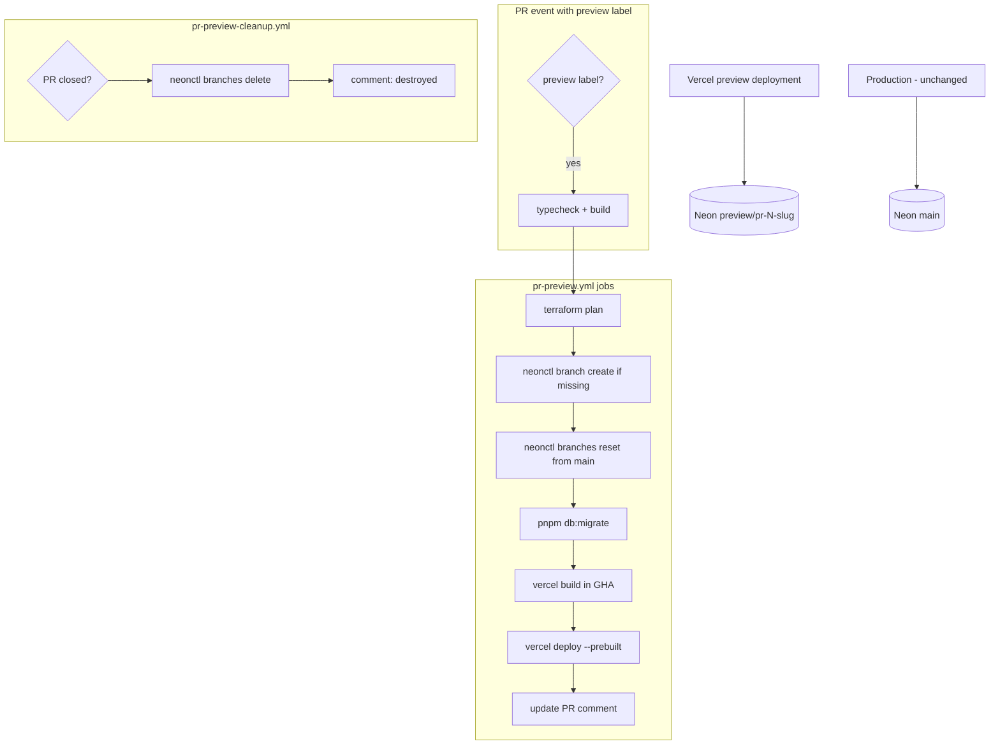
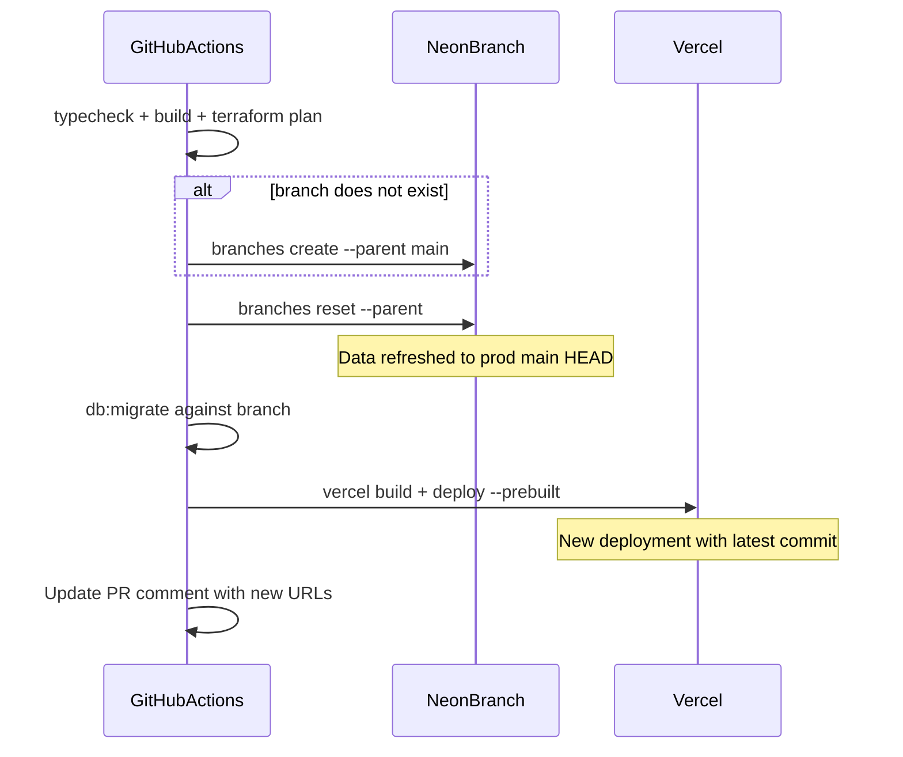

# PR Preview Environment Workflow

## Goals and constraints (from your decisions)

| Requirement | Implementation |
|-------------|----------------|
| Readable naming | Neon: `preview/pr-{number}-{slug}`; Vercel: one project, per-PR deployments |
| PR isolation | Separate Neon branch + per-build `DATABASE_URL`; no shared preview DB in Terraform |
| Fast, reliable redeploys | Reuse Neon **branch name**; GHA caches (pnpm + `.next/cache`); `vercel deploy --prebuilt` (no remote rebuild) |
| Prod data in previews | Fresh prod snapshot on **every** push via `neonctl branches reset --parent` (after first create) |
| Trigger | `preview` label only |
| PR feedback | Single updated comment (`<!-- journal-preview-env -->`) |
| Auth | No changes (deferred) |
| Migration failure | Fail workflow; no Vercel deploy |
| Workflows | Split files; cleanup **only on PR close/merge** (not on label removal) |
| Neon tooling | `neonctl` |
| CI scope | typecheck + build + `terraform plan` before preview deploy |
| Cleanup | Delete Neon branch when PR closes |

---

## Architecture



**Isolation model:** Terraform owns long-lived prod resources. Ephemeral preview DB branches are lifecycle-managed by GitHub Actions + `neonctl`, not Terraform.

---

## Re-push behavior (same labeled PR)

When you push new commits to a PR that already has the `preview` label, the workflow runs again. Here is exactly what happens:



| Layer | First push | Every later push |
|-------|------------|------------------|
| **Neon branch name** | Created: `preview/pr-{n}-{slug}` | **Same name** (not deleted) |
| **Neon data** | Snapshot of prod `main` at create time | **Reset** to latest prod `main` HEAD (`neonctl branches reset … --parent`) |
| **Schema** | `pnpm db:migrate` | `pnpm db:migrate` again (applies PR migrations on fresh prod base) |
| **Vercel app** | New preview deployment | **New** preview deployment (latest code) |
| **Vercel URL** | New `*.vercel.app` URL | New URL (comment always has latest) |
| **pnpm / Next cache** | Cold | Warm (faster build) |

**What “recreated” means in this design:** the **environment state** (fresh prod DB + new app deploy) is recreated each push. The Neon branch **object** is reused so we avoid delete/create churn, extra API calls, and branch-limit pressure — one `reset` command achieves the same data outcome.

**Simple Neon step sequence** (single shell block, no branching logic beyond create-or-skip):

```bash
BRANCH_NAME="preview/pr-42-entry-metadata"

# 1. Ensure branch exists (first push only)
neonctl branches create \
  --project-id "$NEON_PROJECT_ID" \
  --name "$BRANCH_NAME" \
  --parent main \
  --output json 2>/dev/null || true

# 2. Always refresh data from prod main (every push, including first)
neonctl branches reset "$BRANCH_NAME" --parent --project-id "$NEON_PROJECT_ID"

# 3. Migrate + deploy as before
DATABASE_URL=$(neonctl connection-string "$BRANCH_NAME" --pooled --role-name journal --database-name journal ...)
pnpm db:migrate
vercel build && vercel deploy --prebuilt
```

**Trade-off (accepted):** preview-only writes (journal entries created while testing) are **lost on each push**. That is intentional — each push gives a clean prod snapshot + your PR code. Use prod or local dev if you need persistent test data across pushes.

**What we deliberately avoid:** delete + recreate branch each push (slower, more failure modes, same outcome as reset).

---

## Concern 1: Readable branch naming

### Neon branch name (canonical identity)

Format: **`preview/pr-{number}-{slug}`**

| Segment | Source | Rules |
|---------|--------|-------|
| `preview/` | Fixed namespace | Groups ephemeral branches in Neon console |
| `pr-{number}` | `github.event.pull_request.number` | Stable across pushes; primary cleanup key |
| `{slug}` | `github.head_ref` | Lowercase; replace `/` and non-alphanumeric with `-`; collapse repeats; trim to 40 chars; strip leading/trailing `-` |

**Examples:**
- PR #42, branch `feat/entry-metadata` → `preview/pr-42-entry-metadata`
- PR #7, branch `fix-db-pool` → `preview/pr-7-fix-db-pool`

### Shared naming script (DRY between workflows)

Add [`.github/scripts/preview-branch-name.sh`](.github/scripts/preview-branch-name.sh):

```bash
# inputs: PR_NUMBER, HEAD_REF
# output: preview/pr-42-entry-metadata
```

Both [`pr-preview.yml`](.github/workflows/pr-preview.yml) and [`pr-preview-cleanup.yml`](.github/workflows/pr-preview-cleanup.yml) call this script so create/delete always use the same name.

### Vercel URLs (readable vs stable)

- Each deploy gets a unique `*.vercel.app` URL (CLI deploy, git integration off per [github-actions-deploy ADR](docs/adr/2026-06-20/github-actions-deploy.md)).
- **Canonical access point:** PR comment always shows latest App + MCP URLs.
- **Stable bookmark:** Neon branch name + PR number (not the Vercel hash URL).
- Future optional enhancement: `vercel alias set` to a custom subdomain (out of scope for v1).

---

## Concern 2: Vercel preview isolation between PRs

### Problem today

[`infra/terraform/main.tf`](infra/terraform/main.tf) sets `DATABASE_URL` for **both** `production` and `preview` targets:

```4:11:infra/terraform/main.tf
  vercel_env_targets = ["production", "preview"]
  ...
        value     = neon_project.journal.connection_uri_pooler
```

All Vercel preview deployments would share **prod** `DATABASE_URL`.

### Fix (Terraform)

Split env var targeting in [`infra/terraform/main.tf`](infra/terraform/main.tf):

- **`DATABASE_URL`** → `["production"]` only
- **All other vars** (`EMBEDDING_*`, `DATABASE_POOL_*`, `MCP_API_KEY`, optional `AI_GATEWAY_API_KEY`) → keep `["production", "preview"]` (shared across previews; auth not wired yet)

Apply this Terraform change to prod **before** first preview workflow run.

### Per-PR isolation at deploy time

In `pr-preview.yml`, after Neon branch is ready:

```bash
DATABASE_URL=$(neonctl connection-string "$BRANCH_NAME" \
  --project-id "$NEON_PROJECT_ID" \
  --pooled \
  --role-name journal \
  --database-name journal)
export DATABASE_URL
```

This value is set **only in the GHA job env** before `vercel build`. It never lands in Vercel project-level preview env. PR A and PR B cannot cross-contaminate.

### Vercel deployment isolation

- Each workflow run produces a new immutable deployment (separate serverless bundle + runtime env baked at build).
- `concurrency: preview-pr-${{ number }}` with `cancel-in-progress: true` prevents overlapping deploys for the same PR.

---

## Concern 3: Speed — avoid unnecessary full cold starts

### What gets reused vs recreated (2nd+ push)

| Step | First deploy | Subsequent pushes |
|------|--------------|-------------------|
| Neon branch object | `branches create --parent main` | **Reused** (same name) |
| Neon data | Prod snapshot at create | **`branches reset --parent`** (~5–15s; refreshes from prod `main`) |
| pnpm install | Cold ~60–90s | **~10–20s** via `pnpm` cache |
| Next.js compile | Cold ~60–120s | **~30–60s** via `.next/cache` restore |
| `vercel deploy --prebuilt` | ~15–30s upload | ~15–30s upload |
| `db:migrate` | Applies schema | Runs again (fast if no new migrations) |
| `terraform plan` | ~30–60s | ~30–60s |

**Expected total:** ~3–6 min cold, ~2–4 min warm (reset adds a small fixed cost vs pure reuse, but still faster than delete+create).

### Neon: reuse name, reset data (simple, not over-engineered)

- **Reuse** the branch **name** across pushes — no delete/recreate.
- **Reset** data from prod `main` on every push — one CLI command, same cleanup story on PR close.
- **Do not** delete+recreate branch each push — slower, more failure modes, no benefit over `reset`.

### GHA caching strategy

In `pr-preview.yml`:

```yaml
- uses: pnpm/action-setup@v4
  with:
    version: 9.15.4
- uses: actions/setup-node@v4
  with:
    node-version: 20
    cache: pnpm

- uses: actions/cache@v4
  with:
    path: apps/web/.next/cache
    key: next-preview-pr-${{ pr.number }}-${{ hashFiles('pnpm-lock.yaml') }}-${{ hashFiles('apps/**', 'packages/**') }}
    restore-keys: |
      next-preview-pr-${{ pr.number }}-${{ hashFiles('pnpm-lock.yaml') }}-
      next-preview-pr-${{ pr.number }}-
```

Cache key includes PR number so parallel PRs don't share webpack cache, but **same PR reuses** cache across pushes.

### Vercel prebuilt pattern (no remote rebuild)

Follow [Vercel's official GHA pattern](https://vercel.com/kb/guide/how-can-i-use-github-actions-with-vercel):

```bash
vercel pull --yes --environment=preview   # pulls shared preview env (no DATABASE_URL after TF fix)
export DATABASE_URL="..."                  # per-PR override
vercel build                               # builds in GHA → .vercel/output
DEPLOY_URL=$(vercel deploy --prebuilt)     # upload only; seconds not minutes
```

**Why this is reliable:** The artifact uploaded is exactly what was built and migrated against in CI. No "Vercel rebuilt differently" drift.

**Monorepo note:** [`apps/web/vercel.json`](apps/web/vercel.json) and [`infra/terraform/vercel.tf`](infra/terraform/vercel.tf) already define root install/build commands. `vercel pull` + `vercel build` from repo root (or `apps/web` with linked project) must match those commands. Run `vercel pull` from `apps/web` where [`.vercel/project.json`](infra/terraform/.vercel/project.json) lives, or set `VERCEL_ORG_ID` / `VERCEL_PROJECT_ID` env vars explicitly.

### What still runs every push (by design)

- typecheck + build (validates the commit)
- `terraform plan` (infra drift visibility)
- migrate (catches new migrations; fails strict if broken)
- prebuilt deploy (cheap upload)

---

## Concern 4: Label gating

### Triggers — [`pr-preview.yml`](.github/workflows/pr-preview.yml)

```yaml
on:
  pull_request:
    types: [labeled, synchronize, reopened]
```

### Gate condition

```yaml
if: |
  contains(github.event.pull_request.labels.*.name, 'preview') &&
  (github.event.action != 'labeled' || github.event.label.name == 'preview')
```

- Adding `preview` label on an open PR → deploys
- Pushing to a labeled PR → redeploys
- Adding unrelated labels → no deploy
- Removing `preview` label → **no cleanup** (your choice); branch stays until PR closes

### Existing [`pr.yml`](.github/workflows/pr.yml)

Keep rebase check on **all** PRs to `master` unchanged. Preview workflow is additive.

---

## Concern 5: Full CI before deploy

### Job structure in `pr-preview.yml`

Single job `preview` (or split `validate` → `deploy` if you want plan artifacts separate; single job is simpler for v1):

| Step | Command | On failure |
|------|---------|------------|
| Checkout | `actions/checkout@v4` | fail |
| Setup Node + pnpm | see caching above | fail |
| Install | `pnpm install --frozen-lockfile` | fail |
| Typecheck | `pnpm -r typecheck` | fail; update comment "Failed: typecheck" |
| Build (CI validation) | `pnpm --filter @journal/web build` | fail; update comment |
| Terraform plan | see below | fail on CLI error; post plan summary in comment |
| Neon branch | `neonctl` create (if missing) + `reset --parent` | fail |
| Migrate | `DATABASE_URL=... EMBEDDING_DIMENSIONS=1536 pnpm db:migrate` | **fail; no deploy** |
| Vercel prebuilt deploy | pull → build → deploy | fail |
| PR comment | update success comment | always attempted via `if: always()` on final step |

**Note:** Build runs twice conceptually (once as CI check, once inside `vercel build`). Acceptable for v1 reliability. Optimization later: skip standalone `pnpm build` and rely on `vercel build` only, but keep typecheck separate.

### Terraform plan in GHA

Mirror [`infra/terraform/apply.sh`](infra/terraform/apply.sh) credential setup:

```yaml
env:
  TF_API_TOKEN: ${{ secrets.TF_API_TOKEN }}
  VERCEL_API_TOKEN: ${{ secrets.VERCEL_API_TOKEN }}
  NEON_API_KEY: ${{ secrets.NEON_API_KEY }}
  TF_VAR_neon_org_id: ${{ secrets.NEON_ORG_ID }}
  TF_TOKEN_app_terraform_io: ${{ secrets.TF_API_TOKEN }}
  TF_CLI_CONFIG_FILE: ${{ github.workspace }}/infra/terraform/.terraformrc
```

Steps:
1. Write `credentials.tfrc.json` (same Python snippet as `apply.sh`)
2. `cd infra/terraform && terraform init && terraform plan -no-color -out=tfplan`
3. `terraform show -no-color tfplan` → capture output (truncate if >60KB for comment; link to workflow log for full output)
4. **Fail only on** plan command error (auth, init failure). Informational if plan shows changes (expected when PR edits `.tf` files).

---

## Concern 6: PR comment (formatted, all outputs)

### Marker

`<!-- journal-preview-env -->` — find and update existing comment via `gh api` or `actions/github-script`.

### Success template

```markdown
<!-- journal-preview-env -->
## Preview environment

| | |
|---|---|
| **Status** | Ready |
| **App** | {deploy_url} |
| **MCP endpoint** | {deploy_url}/api/mcp |
| **Neon branch** | `{branch_name}` |
| **Neon console** | https://console.neon.tech/app/projects/{project_id}/branches |
| **DB refreshed** | yes — reset from `main` on this push |
| **Parent branch** | `main` |
| **Commit** | `{sha}` |
| **Migrations** | applied |
| **Workflow** | [run #{run_id}]({run_url}) |

<details>
<summary>Terraform plan</summary>

```
{plan_output_truncated}
```

</details>

### Notes
- Preview DB is **reset from prod `main` on every push**. Preview-only writes do not survive re-push.
- Re-push redeploys app + refreshes DB; URL may change — this comment always has the latest.
- Preview is removed when the PR is closed or merged.

<sub>Requires label: `preview`</sub>
```

### Failure template

Update same comment with **Status: Failed**, failed step name, link to workflow logs. No deploy URLs.

### Implementation

Use `actions/github-script@v7`:
- List issue comments on PR
- Find comment containing marker (by `github-actions[bot]` or any author)
- `create` or `update` via REST API

---

## Concern 7: Cleanup on PR close

### [`pr-preview-cleanup.yml`](.github/workflows/pr-preview-cleanup.yml)

```yaml
on:
  pull_request:
    types: [closed]

jobs:
  cleanup:
    if: contains(github.event.pull_request.labels.*.name, 'preview')
```

Steps:
1. Compute `BRANCH_NAME` via shared script
2. `neonctl branches delete "$BRANCH_NAME" --project-id "$NEON_PROJECT_ID"` (ignore 404 if already deleted)
3. Update PR comment: **Status: Destroyed** — preview removed on PR close
4. (Optional) No Vercel deployment deletion — inactive deployments are harmless on Hobby; avoids extra API calls

**Merge = close** in GitHub events, so merged PRs trigger cleanup.

---

## GitHub secrets and variables

| Name | Type | Purpose |
|------|------|---------|
| `VERCEL_TOKEN` | secret | Vercel CLI auth (`VERCEL_API_TOKEN` alias acceptable; pick one name) |
| `VERCEL_ORG_ID` | var | From [`.vercel/project.json`](infra/terraform/.vercel/project.json): `team_ZH2YES8vNPstdirjiHUQ82j4` |
| `VERCEL_PROJECT_ID` | var | `prj_DJ5CbCbNeqIinrqGb0Rd4vJys6dR` |
| `NEON_API_KEY` | secret | Branch create/delete/connection-string |
| `NEON_PROJECT_ID` | var | From `terraform output neon_project_id` |
| `NEON_ORG_ID` | secret | For `TF_VAR_neon_org_id` in plan step |
| `TF_API_TOKEN` | secret | HCP Terraform remote state |
| `GITHUB_TOKEN` | default | PR comments (needs `pull-requests: write`) |

Document in [`infra/README.md`](infra/README.md) new section **"PR preview environments"**.

---

## Files to create / modify

| File | Action |
|------|--------|
| [`.github/workflows/pr-preview.yml`](.github/workflows/pr-preview.yml) | **Create** — full preview pipeline |
| [`.github/workflows/pr-preview-cleanup.yml`](.github/workflows/pr-preview-cleanup.yml) | **Create** — Neon delete + comment |
| [`.github/scripts/preview-branch-name.sh`](.github/scripts/preview-branch-name.sh) | **Create** — shared naming |
| [`infra/terraform/main.tf`](infra/terraform/main.tf) | **Edit** — `DATABASE_URL` production-only |
| [`docs/adr/2026-06-23/pr-preview-environments.md`](docs/adr/2026-06-23/pr-preview-environments.md) | **Create** — decision record |
| [`docs/adr/2026-06-23/README.md`](docs/adr/2026-06-23/README.md) | **Create** — batch index |
| [`docs/adr/README.md`](docs/adr/README.md) | **Edit** — add 2026-06-23 batch |
| [`ARCHITECTURE.md`](ARCHITECTURE.md) | **Edit** — preview env diagram + comparison table row |
| [`TODO.md`](TODO.md) | **Edit** — mark preview items; note prod `deploy.yml` still deferred |
| [`infra/README.md`](infra/README.md) | **Edit** — secrets, label usage, branch naming |

**Out of scope (separate follow-up):** [`deploy.yml`](.github/workflows/deploy.yml) prod pipeline, disabling Vercel git integration, removing `null_resource.prod_migrations`.

---

## Failure modes and guardrails

| Scenario | Behavior |
|----------|----------|
| Neon `branches reset` fails | Job fails; no deploy |
| Migration fails | Job fails; no `vercel deploy`; comment shows failure |
| Neon branch create fails (non-duplicate error) | Job fails |
| Neon at branch limit (free tier) | Job fails; comment suggests closing stale PRs |
| `terraform plan` auth failure | Job fails before any deploy |
| Concurrent pushes | `cancel-in-progress` cancels stale run |
| PR closed mid-deploy | Cleanup job runs independently; branch deleted even if deploy was in flight |
| Missing `preview` label | No workflow run |
| Public repo | Preview URLs public (accepted); no secrets in comment |

---

## Neon / Vercel free-tier notes

- Neon free: limited branches/storage — cleanup on close is essential; document monitoring in ADR.
- Neon `main` branch name matches [`neon.tf`](infra/terraform/neon.tf) (`name = "main"`).
- DB role/database: `journal` / `journal` (not Neon defaults).
- Vercel Hobby: previews supported; no password protection; OIDC for AI Gateway works on preview deployments.
- Use **pooled** connection string (`--pooled`) to match prod [`connection_uri_pooler`](infra/terraform/main.tf).

---

## Rollout checklist (manual, before first test)

1. Apply Terraform change (`DATABASE_URL` production-only) via existing `apply.sh`
2. Add GitHub secrets/vars listed above
3. Merge workflow files to `master`
4. Open test PR, add `preview` label
5. Verify: comment appears, MCP endpoint responds, Neon branch visible in console
6. Push again — confirm DB reset + new Vercel URL in comment; build faster via caches
7. Close PR — confirm Neon branch deleted

---

## Testing plan

| Test | Expected |
|------|----------|
| PR without `preview` label | No preview workflow |
| Add `preview` label | Full pipeline runs; comment posted |
| Push to labeled PR | DB reset from main; new Vercel deploy; comment updated |
| PR with broken migration | Workflow fails; no deploy URL in comment |
| Close PR with label | Neon branch deleted; comment marked destroyed |
| Remove `preview` label (PR open) | No cleanup; branch remains |
| Two PRs with `preview` simultaneously | Separate Neon branches + separate Vercel deployments |
