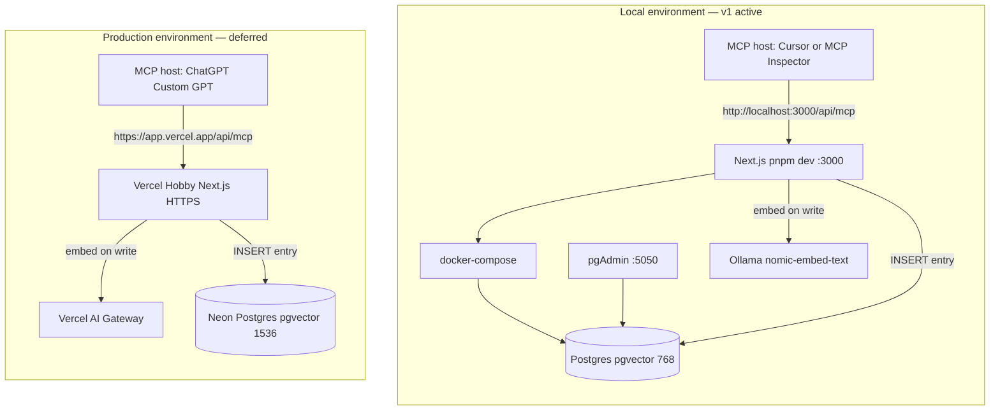
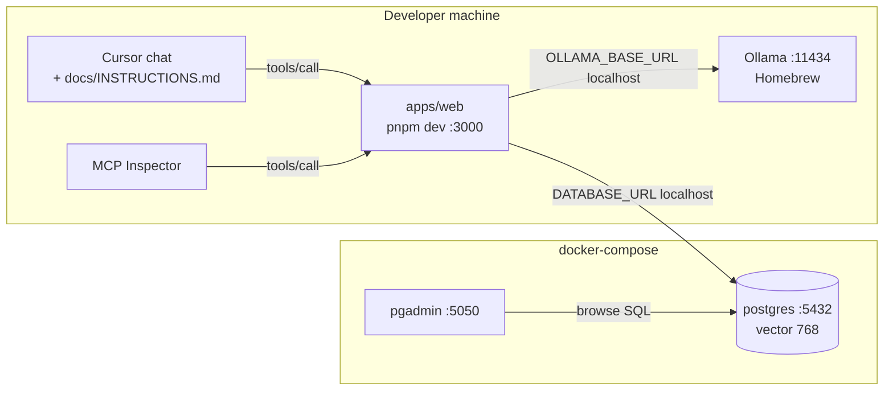
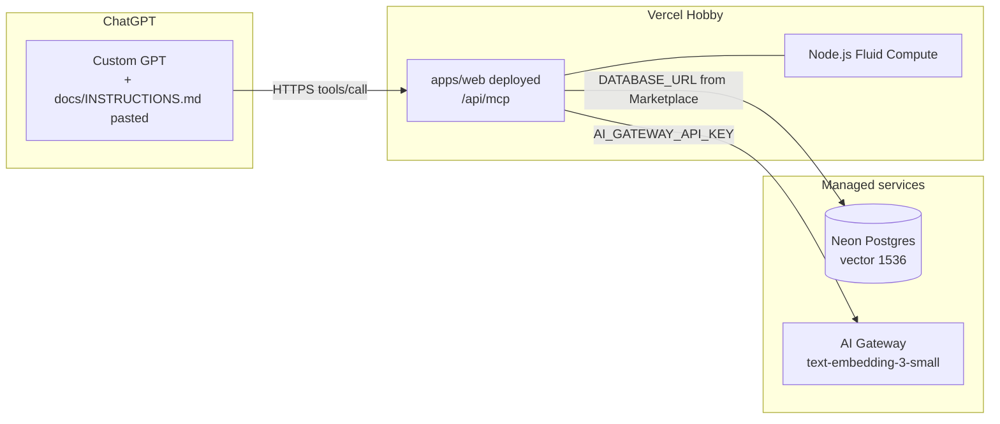
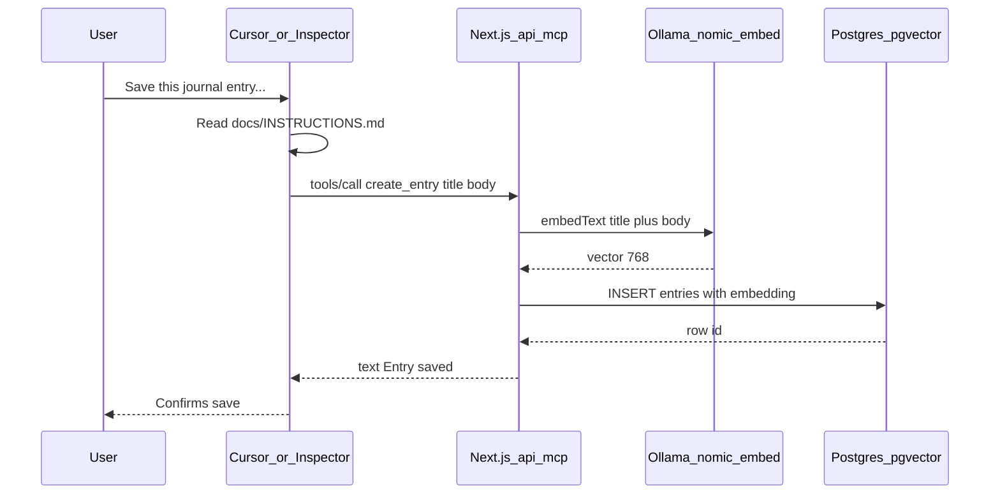
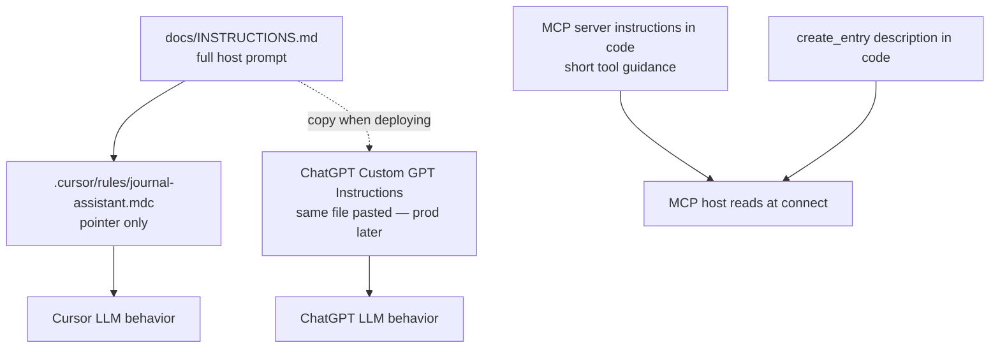
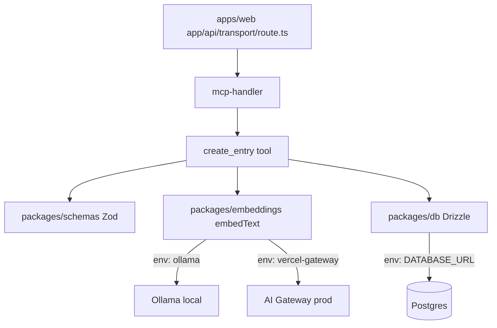

# Architecture

Living design record for the Journal MCP app. Update this file when environments, tools, or providers change.

## System context

Same app code; different infrastructure per environment.



## Local environment



| Local component | Runs as | URL / connection |
|-----------------|---------|------------------|
| MCP server | `pnpm dev` on host | `http://localhost:3000/api/mcp` |
| Postgres + pgvector | Docker | `localhost:5432` |
| Ollama embeddings | Homebrew on host (`brew services start ollama`, also run by `pnpm dev`) | `localhost:11434` |
| pgAdmin | Docker | `http://localhost:5050` |
| MCP host | Cursor or Inspector | `.cursor/mcp.json` |
| Host prompt | `docs/INSTRUCTIONS.md` | via `.cursor/rules` pointer |

## Production environment (deferred)



| Prod component | Runs as | URL / connection |
|----------------|---------|------------------|
| MCP server | Vercel serverless function | `https://<project>.vercel.app/api/mcp` |
| Postgres + pgvector | Neon via Vercel Marketplace | `DATABASE_URL` env injected |
| Embeddings | Vercel AI Gateway | `EMBEDDING_PROVIDER=vercel-gateway` |
| MCP host | ChatGPT Custom GPT + connector | HTTPS + Bearer token |
| Host prompt | Same `docs/INSTRUCTIONS.md` | pasted into Custom GPT Instructions |
| pgAdmin / Ollama | **Not used** | local dev only |

## Environment comparison

| Concern | Local (v1) | Production (deferred) |
|---------|------------|------------------------|
| **MCP endpoint** | `http://localhost:3000/api/mcp` | `https://<project>.vercel.app/api/mcp` |
| **MCP host** | Cursor, MCP Inspector | ChatGPT Custom GPT |
| **App runtime** | `pnpm dev` on host | Vercel serverless Node.js |
| **Postgres** | docker-compose pgvector:pg17 | Neon via Vercel Marketplace |
| **Postgres UI** | pgAdmin :5050 | Neon dashboard / SQL editor |
| **Embeddings** | Ollama `nomic-embed-text` | AI Gateway `text-embedding-3-small` |
| **Vector dims** | 768 | 1536 |
| **EMBEDDING_PROVIDER** | `ollama` | `vercel-gateway` |
| **DATABASE_URL** | `localhost:5432/journal` | Neon connection string |
| **Auth** | None (v1 local) | `MCP_API_KEY` + OAuth (deferred) |
| **Deploy** | None | Vercel Hobby (free) |
| **Data** | Throwaway local volume | Canonical prod data |

**Rule:** never mix embedding models or vector dimensions within the same database. Local and prod are separate databases.

## create_entry sequence (local)



Production sequence is identical except: Host = ChatGPT, MCP = Vercel HTTPS, Embed = AI Gateway, DB = Neon, vector = 1536.

Implementation note: workspace packages are static imports with `transpilePackages`; root `.env` is loaded in `next.config.ts` for build and runtime.

## Instructions and MCP metadata flow



## Monorepo package flow



## MCP tools

| Tool | Status | Description |
|------|--------|-------------|
| `create_entry` | **v1** | Validate title/body, embed, INSERT |
| `list_entries` | TODO | — |
| `get_entry` | TODO | — |
| `update_entry` | TODO | — |
| `delete_entry` | TODO | — |
| `search_entries` | TODO | pgvector similarity search |

## Embedding provider matrix

| Environment | Provider | Model | Dimensions | Runtime |
|-------------|----------|-------|------------|---------|
| Local (v1) | `ollama` | `nomic-embed-text` | 768 | Host Ollama (Homebrew) |
| Production | `vercel-gateway` | `openai/text-embedding-3-small` | 1536 | Vercel AI Gateway (stub only in code) |

Embed input format: `title + "\n\n" + body`.

## Data model

```sql
entries (
  id         uuid PRIMARY KEY DEFAULT gen_random_uuid(),
  user_id    text NOT NULL DEFAULT 'default',
  title      text NOT NULL,
  body       text NOT NULL,
  embedding  vector(768),              -- nomic-embed-text locally
  created_at timestamptz DEFAULT now(),
  updated_at timestamptz DEFAULT now()
)
-- HNSW index on embedding (ready for search_entries later)
```

## ADR-lite decision log

| Date | Decision |
|------|----------|
| 2026-06-19 | Tools-only MCP; no UI widgets |
| 2026-06-19 | Next.js + `mcp-handler` at `/api/mcp` |
| 2026-06-19 | pnpm workspaces only (no Turborepo) |
| 2026-06-19 | `@journal/schemas` instead of generic `shared` package name |
| 2026-06-19 | `init.sql` for pgvector extension; Drizzle for app schema |
| 2026-06-19 | Separate local (768) vs prod (1536) databases |
| 2026-06-19 | MCP auth skipped for local v1; re-enable before prod |
