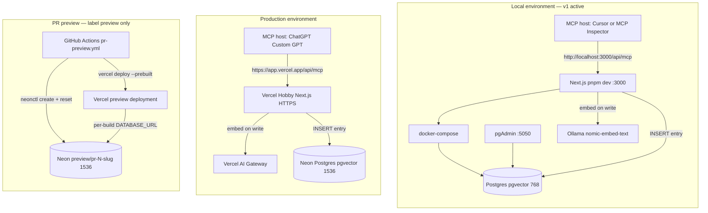
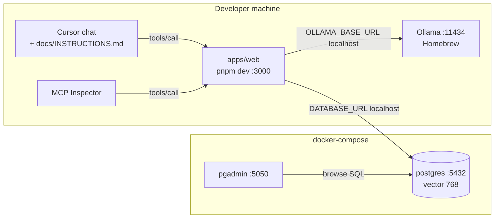
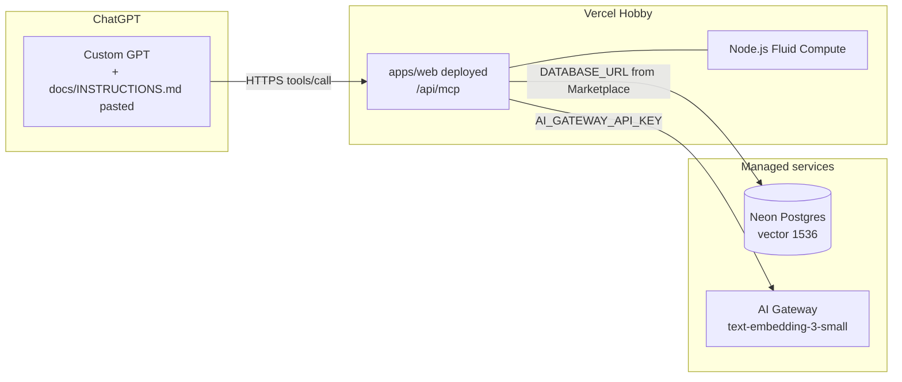
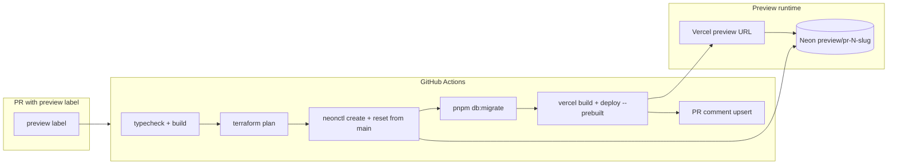
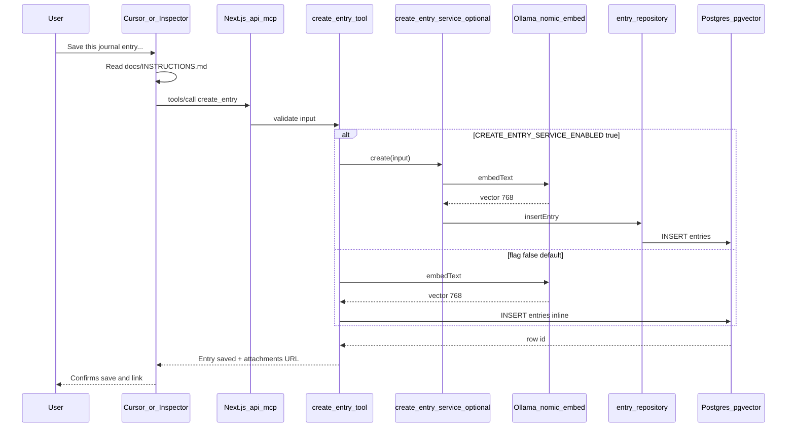
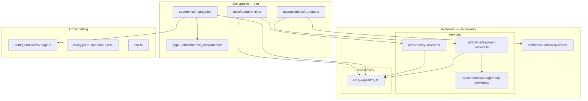
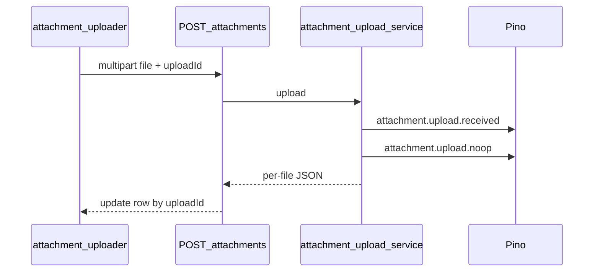
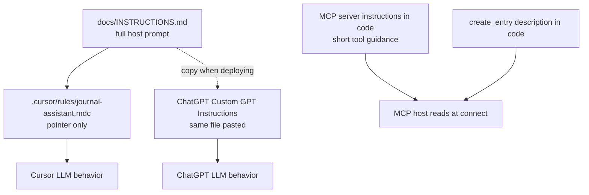
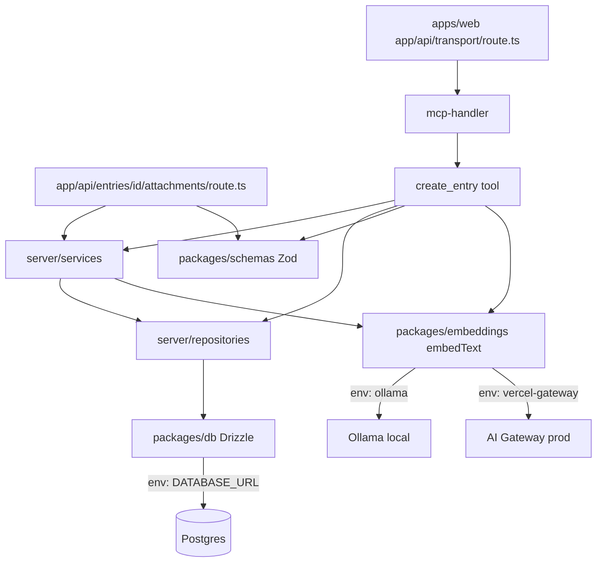

# Architecture

Living design record for the Journal MCP app. Update this file when environments, tools, or providers change.

## System context

Same app code; different infrastructure per environment.



## Local environment



| Local component | Runs as | URL / connection |
|-----------------|---------|------------------|
| MCP server | `pnpm dev` on host | `http://localhost:3000/api/mcp` |
| Postgres + pgvector | Docker | `localhost:5432` |
| Ollama embeddings | Homebrew on host (`brew services start ollama`, also run by `pnpm dev`) | `localhost:11434` |
| pgAdmin | Docker | `http://localhost:5050` |
| MCP host | Cursor or Inspector | `.cursor/mcp.json` |
| Host prompt | `docs/INSTRUCTIONS.md` | via `.cursor/rules` pointer |

## Production environment



| Prod component | Runs as | URL / connection |
|----------------|---------|------------------|
| MCP server | Vercel serverless function | `https://<project>.vercel.app/api/mcp` |
| Postgres + pgvector | Neon via Vercel Marketplace | `DATABASE_URL` env injected |
| Embeddings | Vercel AI Gateway | `EMBEDDING_PROVIDER=vercel-gateway` |
| MCP host | ChatGPT Custom GPT + connector | HTTPS + Bearer token |
| Host prompt | Same `docs/INSTRUCTIONS.md` | pasted into Custom GPT Instructions |
| pgAdmin / Ollama | **Not used** | local dev only |

## PR preview environment

Ephemeral per-PR environments for manual testing before merge. Orchestrated by GitHub Actions — **not** Terraform. See [pr-preview-environments ADR](docs/adr/2026-06-23/pr-preview-environments.md).



| Preview component | Runs as | URL / connection |
|-------------------|---------|------------------|
| Trigger | `preview` label on PR to `master` | [pr-preview.yml](.github/workflows/pr-preview.yml) |
| MCP server | Vercel preview deployment (GHA) | `https://<hash>.vercel.app/api/mcp` (URL in PR comment) |
| Postgres | Neon branch `preview/pr-{number}-{slug}` | Per-build `DATABASE_URL` from `neonctl` — not in Vercel project env |
| Embeddings | Vercel AI Gateway | Shared preview env vars from Terraform (`EMBEDDING_*`) |
| Data | Reset from prod `main` on every push | Preview-only writes lost on re-push |
| Cleanup | PR close/merge | [pr-preview-cleanup.yml](.github/workflows/pr-preview-cleanup.yml) deletes Neon branch |
| Auth | Clerk + MCP OAuth (admin) | Same as prod |

Branch naming: [.github/scripts/preview-branch-name.sh](.github/scripts/preview-branch-name.sh). Rollout steps: [infra/README.md — PR preview environments](infra/README.md#pr-preview-environments).

## Environment comparison

| Concern | Local (v1) | PR preview | Production |
|---------|------------|------------|------------|
| **MCP endpoint** | `http://localhost:3000/api/mcp` | `https://<hash>.vercel.app/api/mcp` (PR comment) | `https://<project>.vercel.app/api/mcp` |
| **MCP host** | Cursor, MCP Inspector | Developer / Cursor (manual) | ChatGPT Custom GPT |
| **App runtime** | `pnpm dev` on host | Vercel preview (GHA prebuilt deploy) | Vercel serverless Node.js |
| **Postgres** | docker-compose pgvector:pg17 | Neon branch per PR (`preview/pr-N-slug`) | Neon `main` via Vercel env |
| **Postgres UI** | pgAdmin :5050 | Neon dashboard | Neon dashboard / SQL editor |
| **Embeddings** | Ollama `nomic-embed-text` | AI Gateway `text-embedding-3-small` | AI Gateway `text-embedding-3-small` |
| **Vector dims** | 768 | 1536 | 1536 |
| **EMBEDDING_PROVIDER** | `ollama` | `vercel-gateway` | `vercel-gateway` |
| **DATABASE_URL** | `localhost:5432/journal` | Per-build in GHA only (not Vercel project preview env) | Neon pooled URL in Vercel `production` target |
| **Auth** | Clerk + MCP OAuth (`publicMetadata.role: admin`) | Clerk + MCP OAuth (admin) | Clerk + MCP OAuth (admin) |
| **Deploy** | None | `preview` label → GHA | Vercel Hobby (manual / future `deploy.yml`) |
| **Data** | Throwaway local volume | Prod snapshot reset each push; not canonical | Canonical prod data |

**Rule:** never mix embedding models or vector dimensions within the same database. Local and prod are separate databases.

## create_entry sequence (local)



Production sequence is identical except: Host = ChatGPT, MCP = Vercel HTTPS, Embed = AI Gateway, DB = Neon, vector = 1536.

`CREATE_ENTRY_SERVICE_ENABLED` (default false) selects **implementation** only; both paths return the same MCP text including the attachments deep link.

## apps/web layering



| Layer | Path | Responsibility |
|-------|------|----------------|
| App Router | `app/` | Pages and API routes; auth at boundary |
| MCP tools | `tools/` | MCP tool handlers |
| Route UI | `app/**/_components/` | Client islands colocated with pages |
| Services | `src/server/services/` | Use cases (create entry, upload) |
| Repositories | `src/server/repositories/` | Drizzle reads/writes |
| Page auth | `src/auth/guard-admin-page.ts` | SSR redirect / 403 |
| Route auth | `src/server/auth/check-admin-access.ts` | 401 / 403 JSON |

## Attachments upload flow (noop MVP)

Admin-only page: `/entries/{id}/attachments`. One `POST` per file to `/api/entries/{id}/attachments` (multipart: `file`, `uploadId`). Client runs ~3 parallel uploads; per-row status in UI. Server logs via Pino; **no blob or DB row** yet — see [entry-attachments-noop-mvp ADR](docs/adr/2026-06-30/entry-attachments-noop-mvp.md).



## Structured logging (Pino)

| Environment | `env` field | Format | `LOG_LEVEL` (default `info`) |
|-------------|-------------|--------|--------------------------------|
| Local dev | `local` | `pino-pretty` | root `.env` — override with `debug` if needed |
| Vercel preview | `preview` | JSON stdout | Vercel env |
| Vercel production | `production` | JSON stdout | Vercel env |

Config: `apps/web/src/lib/logger.ts`, validated via `apps/web/src/env.ts`. `pino` / `pino-pretty` in `serverExternalPackages`.

Implementation note: workspace packages are static imports with `transpilePackages`; root `.env` is loaded in `next.config.ts` for build and runtime.

## Instructions and MCP metadata flow



## Monorepo package flow



## MCP tools

| Tool | Status | Description |
|------|--------|-------------|
| `create_entry` | **v1** | Validate title/body, embed, INSERT |
| `list_entries` | TODO | — |
| `get_entry` | TODO | — |
| `update_entry` | TODO | — |
| `delete_entry` | TODO | — |
| `search_entries` | TODO | pgvector similarity search |

## Embedding provider matrix

| Environment | Provider | Model | Dimensions | Runtime |
|-------------|----------|-------|------------|---------|
| Local (v1) | `ollama` | `nomic-embed-text` | 768 | Host Ollama (Homebrew) |
| Production | `vercel-gateway` | `openai/text-embedding-3-small` | 1536 | Vercel AI Gateway |

Embed input format: `title`, `rewritten_text`, and optional metadata (location, people, tags, mood) — see `formatEntryEmbedText` in `@journal/embeddings`.

## Data model

```sql
entries (
  id              uuid PRIMARY KEY DEFAULT gen_random_uuid(),
  user_id         text NOT NULL DEFAULT 'default',
  title           text NOT NULL,
  rewritten_text  text NOT NULL,
  original_text   text,
  country         text,
  city            text,
  language        text,
  privacy         entry_privacy NOT NULL DEFAULT 'private',
  people          text[],
  tags            text[],
  mood            text,
  embedding       vector,                -- dimensions per EMBEDDING_DIMENSIONS
  created_at      timestamptz NOT NULL DEFAULT now(),
  updated_at      timestamptz NOT NULL DEFAULT now()
)
-- HNSW index on embedding (ready for search_entries later)
```

No `attachments` table in MVP — uploads are logged only.

## Architecture decisions

Durable **why** lives in [`docs/adr/`](docs/adr/README.md) — grouped by date (`YYYY-MM-DD/`), one topic file per major decision, with cross-links between batches. This file stays the living **how/what** record — update diagrams and tables here when the system changes.

| Batch | Topics |
|-------|--------|
| [2026-06-19](docs/adr/2026-06-19/) | MCP, monorepo, Postgres, embeddings, free-tier prod, deferred auth |
| [2026-06-20](docs/adr/2026-06-20/) | Host Ollama workaround, GitHub Actions deploy (proposed) |
| [2026-06-22](docs/adr/2026-06-22/) | Cursor-involved development, entry metadata |
| [2026-06-23](docs/adr/2026-06-23/) | PR preview environments (Neon + Vercel via GHA) |
| [2026-06-25](docs/adr/2026-06-25/) | Clerk app auth, MCP OAuth, admin RBAC |
| [2026-06-30](docs/adr/2026-06-30/) | apps/web layering, attachments noop MVP, Pino logging |
