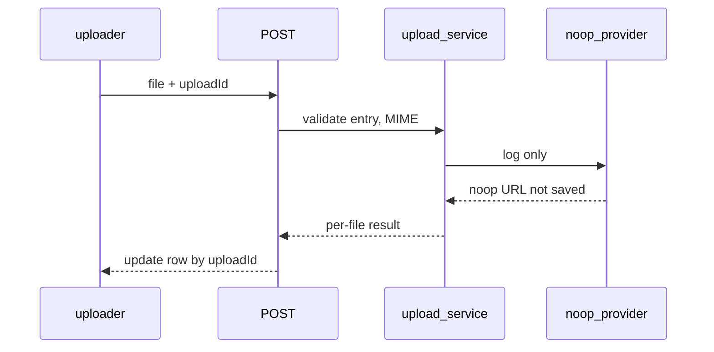

# Entry attachments noop MVP

- **Status:** accepted
- **Relates to:** [apps-web-repositories-services.md](apps-web-repositories-services.md), [pino-structured-logging.md](pino-structured-logging.md), [clerk-mcp-oauth-auth.md](../2026-06-25/clerk-mcp-oauth-auth.md)

## Context

After MCP saves an entry, the admin needs a page to add photos. The goal was full upload UX (pick files, per-file progress, parallel uploads) without blob storage or a new DB table in this batch.

## Decision

Ship the UI and API now; persist nothing. Log uploads with Pino so behavior is visible in Vercel Runtime Logs.

**Surfaces (admin only):**

- Page: `/entries/{id}/attachments` — SSR title + client uploader
- API: `POST /api/entries/{id]/attachments` — one file per request, multipart (`file`, `uploadId`)

**Flow:**

**Implementation:**

- `attachment-upload-service` — checks entry exists, images only (`jpeg`, `png`, `webp`, `heic`)
- `AttachmentStorageProvider` interface + noop implementation (swap in step 2)
- `attachmentUploadRequestSchema` in `@journal/schemas` for API input; UI status types stay in `_components/`
- MCP response includes `Add attachments: {baseUrl}/entries/{id}/attachments`

**Deferred:** `attachments` table, real blob storage, video/audio, listing saved files.

## Consequences

**Good:** End-to-end upload flow without storage cost; clear seam for step 2.

**Bad:** Files are not stored; uploads disappear after the request.

**Later:** Migration + real provider (e.g. Vercel Blob) behind the same interface.
