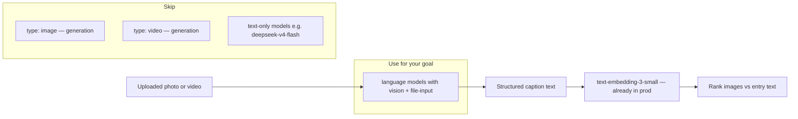

# Vision models for attachment understanding (~$0)

Plan for captioning uploaded images and videos via Vercel AI Gateway so attachments can be ranked against entry text. Implement after blob storage and the `attachments` table land.

**Status:** planned (blocked on blob persistence)

## Goal

When you upload images (and later videos), you want a **text description** of what is in the media so you can later **match the best attachments to entry text** (semantic ranking). That is **vision understanding**, not image/video **generation**.

**Do not use** gateway `type: video` models (Veo, Kling, Seedance, Wan, etc.) or `type: image` models (Flux, Imagen, GPT-Image). Those create new media; they do not describe uploads.

---

## How gateway models are categorized



Discover models programmatically:

```typescript
const { models } = await gateway.getAvailableModels();
const visionModels = models.filter((m) =>
  m.modelType === 'language' && m.description?.toLowerCase().includes('vision')
);
```

Or browse: [AI Gateway models — Free Tier filter](https://vercel.com/ai-gateway/models?freeTier=true)

---

## Free tier constraint

Prod already uses AI Gateway for embeddings ([`infra/terraform/ai_gateway.tf`](../../infra/terraform/ai_gateway.tf)). The same gateway applies here:

- **~$5/month free credits** on Vercel team accounts (refreshes monthly until you buy paid credits)
- **Only a subset of models** work on free tier — others return `403 RestrictedModelsError`
- Filter: [vercel.com/ai-gateway/models?freeTier=true](https://vercel.com/ai-gateway/models?freeTier=true)

For a personal journal, $5/month is enormous for captioning. Staying on **free-tier-eligible vision models** keeps cost at **~$0**.

---

## Recommended models

### Images

| Priority | Model ID | Why | Input $/M | Output $/M | Free tier |
|----------|----------|-----|-----------|------------|-----------|
| **1 (free tier)** | `google/gemini-3.1-flash-lite` | On free-tier list; `vision` + `file-input`; 1M context; good quality/cost | $0.25 | $1.50 | Yes |
| **2 (free tier)** | `google/gemini-3.5-flash` | On free-tier list; stronger if lite is too shallow | $0.15 | — | Yes |
| **3 (free tier)** | `stepfun/step-3.7-flash` | On free-tier list; multimodal reasoning; `text+image` only (no `file`) | $0.20 | $1.15 | Yes |
| **4 (cheapest paid)** | `openai/gpt-5-nano` | Lowest token price; `vision` + `file-input` | $0.05 | $0.40 | Unclear — test in dashboard |
| **5 (cheapest paid)** | `amazon/nova-lite` | Explicitly marketed for image **and video**; very cheap | $0.06 | $0.24 | Likely paid-only |
| **6 (good paid fallback)** | `google/gemini-2.5-flash-lite` | Excellent latency/price | $0.10 | $0.40 | Likely paid-only |

**Avoid for captioning:** `google/gemini-3.1-flash-image` and `google/gemini-3.1-flash-lite-image` — image-generation models (`image-generation` tag). Overkill for “describe this photo.”

**Avoid:** `deepseek/deepseek-v4-flash` — on free tier but **text-only** (no `vision` tag).

### Videos

Gateway `type: video` models are **generators**, not analyzers. For **understanding** uploaded video, use **vision language models** that accept **`file` input** (`file-input` tag):

| Priority | Model ID | Video approach | Notes |
|----------|----------|----------------|-------|
| **1 (direct)** | `amazon/nova-lite` | Pass video as `file` part in `generateText` | Cheapest multimodal; description says image, video, text |
| **2 (direct)** | `amazon/nova-2-lite` | Same | Better reasoning; ~3× pricier than nova-lite |
| **3 (direct)** | `xiaomi/mimo-v2.5` | `file` input | Claims video + audio understanding |
| **4 (~$0 strategy)** | `google/gemini-3.1-flash-lite` | **Keyframe captions** | Extract 2–3 frames (ffmpeg), caption each as image — usually 5–20× cheaper than full-video tokens |

Many models list `input_modalities: [text, image, file]` even when marketing mentions video. Video is typically sent as a **file part** (mp4/mov). Test with a short clip before committing.

**`stepfun/step-3.7-flash`** claims video understanding but only exposes `text+image` modalities — treat video via **keyframes**, not raw file upload.

---

## Suggested default for this project

Given free-tier production ([`docs/adr/2026-06-19/free-tier-production.md`](../adr/2026-06-19/free-tier-production.md)) and personal journal volume:

| Media | Model | Rationale |
|-------|-------|-----------|
| **Images** | `google/gemini-3.1-flash-lite` | Free-tier eligible, vision + file-input, structured JSON output |
| **Videos** | Keyframes → same model | Keeps you on free tier; avoids expensive video-token billing |
| **Matching to entries** | Keep `openai/text-embedding-3-small` | Embed caption text (not image bytes) — reuses [`packages/embeddings`](../../packages/embeddings) with no new vector dimensions |

Local dev: gateway for testing, or a local vision model via Ollama later (same pattern as `ollama` vs `vercel-gateway` for embeddings).

---

## What to extract (prompt shape)

Ask the vision model for **compact, search-friendly structured text**:

- scene summary (1 sentence)
- subjects / people (if any)
- location cues (indoor/outdoor, landmarks)
- mood / lighting
- tags (5–10 keywords)

That text becomes the attachment embedding input — same philosophy as `formatEntryEmbedText()` for entries.

Example prompt intent: *“Return JSON: {summary, subjects, location, mood, tags}. Be factual; no creative writing.”*

---

## Cost estimate (personal journal)

Rough order of magnitude with `google/gemini-3.1-flash-lite`:

| Volume | Images (~500 input tokens + 150 output each) | Monthly cost |
|--------|-----------------------------------------------|--------------|
| 50 uploads | ~32k tokens | **< $0.05** |
| 200 uploads | ~130k tokens | **< $0.20** |
| 1000 uploads | ~650k tokens | **< $1** |

All well inside the **$5 free credit**. Video direct-upload can be 10–100× more expensive per clip; keyframe approach stays in the same ballpark as images.

Embedding cost (`text-embedding-3-small` at ~$0.02/M tokens) for captions is negligible on top of this.

---

## How to verify before implementing

1. Open [AI Gateway dashboard](https://vercel.com/dashboard) → AI Gateway → Model List → enable **Free Tier** filter.
2. Test one image with `generateText` + `gateway('google/gemini-3.1-flash-lite')` and an image `file` part.
3. If you get `403 RestrictedModelsError`, pick the next model on the free-tier list.
4. For video: try a short clip on `amazon/nova-lite` only if OK leaving free-tier-only; otherwise use keyframes + gemini lite.

```typescript
import { generateText } from 'ai';
import { gateway } from '@ai-sdk/gateway';

const { text } = await generateText({
  model: gateway('google/gemini-3.1-flash-lite'),
  messages: [{
    role: 'user',
    content: [
      { type: 'text', text: 'Describe this journal photo as JSON: summary, subjects, mood, tags.' },
      { type: 'file', data: imageBytes, mediaType: 'image/jpeg' },
    ],
  }],
});
```

---

## Summary

- **Images:** `google/gemini-3.1-flash-lite` (free tier, best fit for ~$0).
- **Videos:** same model on **2–3 keyframes** (cheapest); `amazon/nova-lite` if you need native video file input and accept paid-tier.
- **Matching:** embed caption text with existing `text-embedding-3-small` pipeline — no new embedding model needed.
- **Skip:** video generators, image generators, and text-only models like `deepseek-v4-flash`.

**Prerequisite:** blob storage + `attachments` table ([entry-attachments-noop-mvp ADR](../adr/2026-06-30/entry-attachments-noop-mvp.md) — step 2 after noop MVP).
